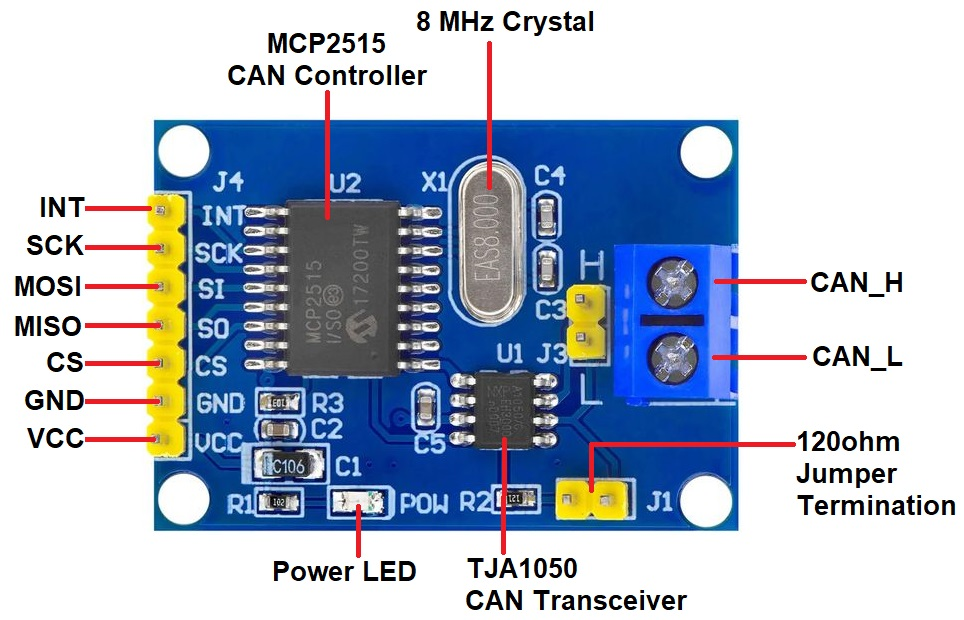
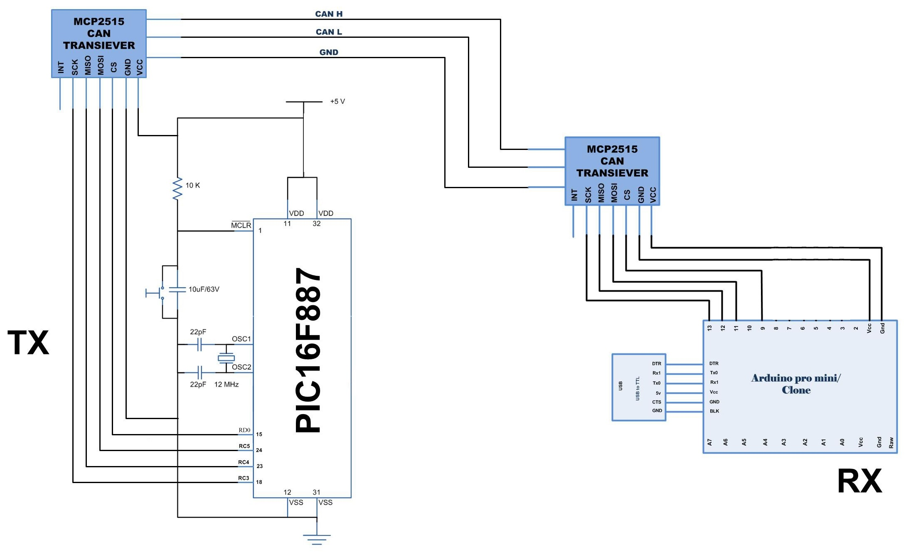

# can_bus_pic16
 Can bus Pic16F877A with MCP2515.

 This project is a library modification of https://github.com/Seeed-Studio/Seeed_Arduino_CAN from Arduino. 

 MPLAB X IDE and XC8 compiler are used for to test this application with PIC16F877A from microchip.

